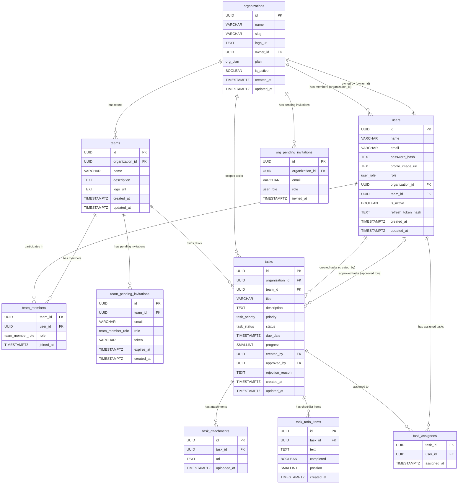

# TaskManager — PostgreSQL Relational Database Schema

> Translated from the legacy Mongoose/MongoDB schemas in `legacy-nestjs/src/modules/`.  
> Target: PostgreSQL 15+ with a fully normalized, multi-tenant relational design.

---

## Design Principles

| Principle | Decision |
|---|---|
| **Multi-tenancy** | Row-level isolation: every tenant-scoped table carries an `organization_id` FK. |
| **PKs** | `UUID` (PostgreSQL `gen_random_uuid()`) — matches the spirit of MongoDB's ObjectId and is globally unique without coordination. |
| **Timestamps** | Every table has `created_at` / `updated_at` (`TIMESTAMPTZ NOT NULL DEFAULT now()`). |
| **Enum types** | Modelled as PostgreSQL `ENUM` types for strict validation. |
| **Arrays → tables** | All embedded arrays from Mongoose (`members`, `pendingInvitations`, `assignedTo`, `todoCheckList`, `attachments`) are split into dedicated child/junction tables. |
| **Soft delete** | `is_active BOOLEAN` is preserved where the legacy schema had it. |
| **OTP / sessions** | Managed entirely in Redis (short-lived keys); not persisted in PostgreSQL. |

---

## Enum Type Definitions

```sql
-- User system-level role within an organization
CREATE TYPE user_role AS ENUM ('owner', 'admin', 'member');

-- Role within a specific team
CREATE TYPE team_member_role AS ENUM ('TEAM_LEAD', 'TEAM_MEMBER');

-- Subscription plan of an organization
CREATE TYPE org_plan AS ENUM ('free', 'pro', 'enterprise');

-- Task completion status
CREATE TYPE task_status AS ENUM (
    'Pending',
    'In Progress',
    'Completed',
    'Pending Approval',
    'Rejected'
);

-- Task urgency level
CREATE TYPE task_priority AS ENUM ('Low', 'Medium', 'High');
```

---

## Tables

### 1. `organizations`

> Translated from: `Organization` schema + `OrgPendingInvitation` sub-document (invitations moved to own table).

| Column | Type | Constraints | Notes |
|---|---|---|---|
| `id` | `UUID` | `PRIMARY KEY DEFAULT gen_random_uuid()` | |
| `name` | `VARCHAR(255)` | `NOT NULL UNIQUE` | |
| `slug` | `VARCHAR(255)` | `NOT NULL UNIQUE` | Auto-generated (`name-<6hexChars>`), lowercase |
| `logo_url` | `TEXT` | `NULL` | |
| `owner_id` | `UUID` | `NOT NULL REFERENCES users(id)` | Initially deferred to break circular dep |
| `plan` | `org_plan` | `NOT NULL DEFAULT 'free'` | |
| `is_active` | `BOOLEAN` | `NOT NULL DEFAULT TRUE` | |
| `created_at` | `TIMESTAMPTZ` | `NOT NULL DEFAULT now()` | |
| `updated_at` | `TIMESTAMPTZ` | `NOT NULL DEFAULT now()` | |

```sql
CREATE TABLE organizations (
    id          UUID          PRIMARY KEY DEFAULT gen_random_uuid(),
    name        VARCHAR(255)  NOT NULL UNIQUE,
    slug        VARCHAR(255)  NOT NULL UNIQUE,
    logo_url    TEXT,
    owner_id    UUID          NOT NULL,  -- FK added after users table via ALTER TABLE
    plan        org_plan      NOT NULL DEFAULT 'free',
    is_active   BOOLEAN       NOT NULL DEFAULT TRUE,
    created_at  TIMESTAMPTZ   NOT NULL DEFAULT now(),
    updated_at  TIMESTAMPTZ   NOT NULL DEFAULT now()
);

CREATE INDEX idx_organizations_is_active_owner ON organizations (is_active, owner_id);
```

---

### 2. `users`

> Translated from: `User` schema.  
> `refreshToken` is stored here as a **bcrypt hash** — only loaded via explicit `SELECT`.

| Column | Type | Constraints | Notes |
|---|---|---|---|
| `id` | `UUID` | `PRIMARY KEY DEFAULT gen_random_uuid()` | |
| `name` | `VARCHAR(255)` | `NOT NULL` | |
| `email` | `VARCHAR(255)` | `NOT NULL UNIQUE` | Stored lowercase |
| `password_hash` | `TEXT` | `NOT NULL` | bcrypt hash |
| `profile_image_url` | `TEXT` | `NULL` | |
| `role` | `user_role` | `NOT NULL DEFAULT 'member'` | Org-level role |
| `organization_id` | `UUID` | `NOT NULL REFERENCES organizations(id)` | Primary org (SaaS tenant) |
| `team_id` | `UUID` | `REFERENCES teams(id) ON DELETE SET NULL` | Nullable |
| `is_active` | `BOOLEAN` | `NOT NULL DEFAULT TRUE` | |
| `refresh_token_hash` | `TEXT` | `NULL` | bcrypt hash; NULL when logged out |
| `created_at` | `TIMESTAMPTZ` | `NOT NULL DEFAULT now()` | |
| `updated_at` | `TIMESTAMPTZ` | `NOT NULL DEFAULT now()` | |

```sql
CREATE TABLE users (
    id                  UUID          PRIMARY KEY DEFAULT gen_random_uuid(),
    name                VARCHAR(255)  NOT NULL,
    email               VARCHAR(255)  NOT NULL UNIQUE,
    password_hash       TEXT          NOT NULL,
    profile_image_url   TEXT,
    role                user_role     NOT NULL DEFAULT 'member',
    organization_id     UUID          NOT NULL REFERENCES organizations(id) ON DELETE CASCADE,
    team_id             UUID,         -- FK added after teams table via ALTER TABLE
    is_active           BOOLEAN       NOT NULL DEFAULT TRUE,
    refresh_token_hash  TEXT,
    created_at          TIMESTAMPTZ   NOT NULL DEFAULT now(),
    updated_at          TIMESTAMPTZ   NOT NULL DEFAULT now()
);

CREATE INDEX idx_users_organization_id ON users (organization_id);
CREATE INDEX idx_users_email           ON users (email);
```

> **Circular dependency resolution:**  
> `organizations.owner_id` references `users.id` AND `users.organization_id` references `organizations.id`.  
> In DDL: create both tables without the cross-FK first, then `ALTER TABLE` to add them.  
> In the registration service (Java): wrap Organization + User creation in a single `@Transactional` block — mirrors the legacy Mongoose session/transaction pattern.

---

### 3. `teams`

> Translated from: `Team` schema. Members and pending invitations split to child tables.

| Column | Type | Constraints | Notes |
|---|---|---|---|
| `id` | `UUID` | `PRIMARY KEY DEFAULT gen_random_uuid()` | |
| `organization_id` | `UUID` | `NOT NULL REFERENCES organizations(id) ON DELETE CASCADE` | Tenant scope |
| `name` | `VARCHAR(255)` | `NOT NULL` | Unique within org (see index) |
| `description` | `TEXT` | `NOT NULL DEFAULT ''` | |
| `logo_url` | `TEXT` | `NULL` | |
| `created_at` | `TIMESTAMPTZ` | `NOT NULL DEFAULT now()` | |
| `updated_at` | `TIMESTAMPTZ` | `NOT NULL DEFAULT now()` | |

```sql
CREATE TABLE teams (
    id               UUID         PRIMARY KEY DEFAULT gen_random_uuid(),
    organization_id  UUID         NOT NULL REFERENCES organizations(id) ON DELETE CASCADE,
    name             VARCHAR(255) NOT NULL,
    description      TEXT         NOT NULL DEFAULT '',
    logo_url         TEXT,
    created_at       TIMESTAMPTZ  NOT NULL DEFAULT now(),
    updated_at       TIMESTAMPTZ  NOT NULL DEFAULT now(),

    -- Mirrors legacy: TeamSchema.index({ organization: 1, name: 1 }, { unique: true })
    CONSTRAINT uq_teams_org_name UNIQUE (organization_id, name)
);

CREATE INDEX idx_teams_organization_created ON teams (organization_id, created_at DESC);
```

---

### 4. `team_members` *(Junction Table)*

> Translated from: `TeamMember` sub-document array embedded in `Team`.  
> A user can belong to multiple teams (M:N relationship).

| Column | Type | Constraints | Notes |
|---|---|---|---|
| `team_id` | `UUID` | `NOT NULL REFERENCES teams(id) ON DELETE CASCADE` | |
| `user_id` | `UUID` | `NOT NULL REFERENCES users(id) ON DELETE CASCADE` | |
| `role` | `team_member_role` | `NOT NULL DEFAULT 'TEAM_MEMBER'` | TEAM_LEAD or TEAM_MEMBER |
| `joined_at` | `TIMESTAMPTZ` | `NOT NULL DEFAULT now()` | |

```sql
CREATE TABLE team_members (
    team_id    UUID              NOT NULL REFERENCES teams(id) ON DELETE CASCADE,
    user_id    UUID              NOT NULL REFERENCES users(id) ON DELETE CASCADE,
    role       team_member_role  NOT NULL DEFAULT 'TEAM_MEMBER',
    joined_at  TIMESTAMPTZ       NOT NULL DEFAULT now(),

    PRIMARY KEY (team_id, user_id)
);

-- Efficiently find all teams a specific user belongs to (getMyTeams API)
CREATE INDEX idx_team_members_user_id   ON team_members (user_id);
CREATE INDEX idx_team_members_team_role ON team_members (team_id, role);
```

---

### 5. `team_pending_invitations`

> Translated from: `PendingInvitation` sub-document array embedded in `Team`.

| Column | Type | Constraints | Notes |
|---|---|---|---|
| `id` | `UUID` | `PRIMARY KEY DEFAULT gen_random_uuid()` | |
| `team_id` | `UUID` | `NOT NULL REFERENCES teams(id) ON DELETE CASCADE` | |
| `email` | `VARCHAR(255)` | `NOT NULL` | Invitee email (may not be a user yet) |
| `role` | `team_member_role` | `NOT NULL DEFAULT 'TEAM_MEMBER'` | Intended role upon acceptance |
| `token` | `VARCHAR(255)` | `NOT NULL UNIQUE` | Secure random token for accept link |
| `expires_at` | `TIMESTAMPTZ` | `NOT NULL` | Invitation expiry |
| `created_at` | `TIMESTAMPTZ` | `NOT NULL DEFAULT now()` | |

```sql
CREATE TABLE team_pending_invitations (
    id          UUID              PRIMARY KEY DEFAULT gen_random_uuid(),
    team_id     UUID              NOT NULL REFERENCES teams(id) ON DELETE CASCADE,
    email       VARCHAR(255)      NOT NULL,
    role        team_member_role  NOT NULL DEFAULT 'TEAM_MEMBER',
    token       VARCHAR(255)      NOT NULL UNIQUE,
    expires_at  TIMESTAMPTZ       NOT NULL,
    created_at  TIMESTAMPTZ       NOT NULL DEFAULT now(),

    CONSTRAINT uq_team_pending_email UNIQUE (team_id, email)
);

CREATE INDEX idx_team_invitations_email ON team_pending_invitations (email);
CREATE INDEX idx_team_invitations_token ON team_pending_invitations (token);
```

---

### 6. `org_pending_invitations`

> Translated from: `OrgPendingInvitation` sub-document array embedded in `Organization`.

| Column | Type | Constraints | Notes |
|---|---|---|---|
| `id` | `UUID` | `PRIMARY KEY DEFAULT gen_random_uuid()` | |
| `organization_id` | `UUID` | `NOT NULL REFERENCES organizations(id) ON DELETE CASCADE` | |
| `email` | `VARCHAR(255)` | `NOT NULL` | Invitee email |
| `role` | `user_role` | `NOT NULL DEFAULT 'member'` | Intended role upon joining |
| `invited_at` | `TIMESTAMPTZ` | `NOT NULL DEFAULT now()` | |

```sql
CREATE TABLE org_pending_invitations (
    id               UUID        PRIMARY KEY DEFAULT gen_random_uuid(),
    organization_id  UUID        NOT NULL REFERENCES organizations(id) ON DELETE CASCADE,
    email            VARCHAR(255) NOT NULL,
    role             user_role   NOT NULL DEFAULT 'member',
    invited_at       TIMESTAMPTZ NOT NULL DEFAULT now(),

    CONSTRAINT uq_org_pending_email UNIQUE (organization_id, email)
);

CREATE INDEX idx_org_invitations_email ON org_pending_invitations (email);
```

---

### 7. `tasks`

> Translated from: `Task` schema. `assignedTo`, `todoCheckList`, and `attachments` arrays split to child tables.

| Column | Type | Constraints | Notes |
|---|---|---|---|
| `id` | `UUID` | `PRIMARY KEY DEFAULT gen_random_uuid()` | |
| `organization_id` | `UUID` | `NOT NULL REFERENCES organizations(id) ON DELETE CASCADE` | Tenant scope |
| `team_id` | `UUID` | `NOT NULL REFERENCES teams(id) ON DELETE RESTRICT` | Task must belong to a team |
| `title` | `VARCHAR(500)` | `NOT NULL` | |
| `description` | `TEXT` | `NOT NULL` | |
| `priority` | `task_priority` | `NOT NULL DEFAULT 'Medium'` | |
| `status` | `task_status` | `NOT NULL DEFAULT 'Pending'` | |
| `due_date` | `TIMESTAMPTZ` | `NOT NULL` | |
| `progress` | `SMALLINT` | `NOT NULL DEFAULT 0 CHECK (progress >= 0 AND progress <= 100)` | 0-100 |
| `created_by` | `UUID` | `NOT NULL REFERENCES users(id) ON DELETE RESTRICT` | |
| `approved_by` | `UUID` | `REFERENCES users(id) ON DELETE SET NULL` | NULL until approved |
| `rejection_reason` | `TEXT` | `NULL` | Set when status = 'Rejected' |
| `created_at` | `TIMESTAMPTZ` | `NOT NULL DEFAULT now()` | |
| `updated_at` | `TIMESTAMPTZ` | `NOT NULL DEFAULT now()` | |

```sql
CREATE TABLE tasks (
    id               UUID           PRIMARY KEY DEFAULT gen_random_uuid(),
    organization_id  UUID           NOT NULL REFERENCES organizations(id) ON DELETE CASCADE,
    team_id          UUID           NOT NULL REFERENCES teams(id) ON DELETE RESTRICT,
    title            VARCHAR(500)   NOT NULL,
    description      TEXT           NOT NULL,
    priority         task_priority  NOT NULL DEFAULT 'Medium',
    status           task_status    NOT NULL DEFAULT 'Pending',
    due_date         TIMESTAMPTZ    NOT NULL,
    progress         SMALLINT       NOT NULL DEFAULT 0 CHECK (progress >= 0 AND progress <= 100),
    created_by       UUID           NOT NULL REFERENCES users(id) ON DELETE RESTRICT,
    approved_by      UUID           REFERENCES users(id) ON DELETE SET NULL,
    rejection_reason TEXT,
    created_at       TIMESTAMPTZ    NOT NULL DEFAULT now(),
    updated_at       TIMESTAMPTZ    NOT NULL DEFAULT now()
);

-- Mirrors legacy: TaskSchema.index({ organization: 1, team: 1, createdAt: -1 })
CREATE INDEX idx_tasks_org_team_created   ON tasks (organization_id, team_id, created_at DESC);

-- Mirrors legacy: TaskSchema.index({ organization: 1, status: 1, dueDate: 1 })
CREATE INDEX idx_tasks_org_status_duedate ON tasks (organization_id, status, due_date);
```

---

### 8. `task_assignees` *(Junction Table)*

> Translated from: `assignedTo: Types.ObjectId[]` in `Task`.

| Column | Type | Constraints | Notes |
|---|---|---|---|
| `task_id` | `UUID` | `NOT NULL REFERENCES tasks(id) ON DELETE CASCADE` | |
| `user_id` | `UUID` | `NOT NULL REFERENCES users(id) ON DELETE CASCADE` | |
| `assigned_at` | `TIMESTAMPTZ` | `NOT NULL DEFAULT now()` | |

```sql
CREATE TABLE task_assignees (
    task_id      UUID        NOT NULL REFERENCES tasks(id) ON DELETE CASCADE,
    user_id      UUID        NOT NULL REFERENCES users(id) ON DELETE CASCADE,
    assigned_at  TIMESTAMPTZ NOT NULL DEFAULT now(),

    PRIMARY KEY (task_id, user_id)
);

-- Mirrors legacy: TaskSchema.index({ organization: 1, assignedTo: 1, createdAt: -1 })
CREATE INDEX idx_task_assignees_user_id ON task_assignees (user_id);
```

---

### 9. `task_todo_items`

> Translated from: `TodoItem` sub-document array (`todoCheckList`) in `Task`. The `_id: true` on the sub-document is preserved as a proper `UUID` PK.

| Column | Type | Constraints | Notes |
|---|---|---|---|
| `id` | `UUID` | `PRIMARY KEY DEFAULT gen_random_uuid()` | Mirrors `_id: true` on sub-document |
| `task_id` | `UUID` | `NOT NULL REFERENCES tasks(id) ON DELETE CASCADE` | |
| `text` | `TEXT` | `NOT NULL` | |
| `completed` | `BOOLEAN` | `NOT NULL DEFAULT FALSE` | |
| `position` | `SMALLINT` | `NOT NULL DEFAULT 0` | Preserves insertion order |
| `created_at` | `TIMESTAMPTZ` | `NOT NULL DEFAULT now()` | |

```sql
CREATE TABLE task_todo_items (
    id          UUID        PRIMARY KEY DEFAULT gen_random_uuid(),
    task_id     UUID        NOT NULL REFERENCES tasks(id) ON DELETE CASCADE,
    text        TEXT        NOT NULL,
    completed   BOOLEAN     NOT NULL DEFAULT FALSE,
    position    SMALLINT    NOT NULL DEFAULT 0,
    created_at  TIMESTAMPTZ NOT NULL DEFAULT now()
);

CREATE INDEX idx_todo_items_task_id ON task_todo_items (task_id, position);
```

---

### 10. `task_attachments`

> Translated from: `attachments: string[]` in `Task`.

| Column | Type | Constraints | Notes |
|---|---|---|---|
| `id` | `UUID` | `PRIMARY KEY DEFAULT gen_random_uuid()` | |
| `task_id` | `UUID` | `NOT NULL REFERENCES tasks(id) ON DELETE CASCADE` | |
| `url` | `TEXT` | `NOT NULL` | File URL (S3, Cloudinary, etc.) |
| `uploaded_at` | `TIMESTAMPTZ` | `NOT NULL DEFAULT now()` | |

```sql
CREATE TABLE task_attachments (
    id           UUID        PRIMARY KEY DEFAULT gen_random_uuid(),
    task_id      UUID        NOT NULL REFERENCES tasks(id) ON DELETE CASCADE,
    url          TEXT        NOT NULL,
    uploaded_at  TIMESTAMPTZ NOT NULL DEFAULT now()
);

CREATE INDEX idx_task_attachments_task_id ON task_attachments (task_id);
```

---

## Deferred Foreign Keys (Circular Dependency Resolution)

The `organizations.owner_id <-> users.organization_id` circular reference is resolved:

```sql
-- Run AFTER both tables are created:
ALTER TABLE organizations
    ADD CONSTRAINT fk_org_owner
    FOREIGN KEY (owner_id) REFERENCES users(id) DEFERRABLE INITIALLY DEFERRED;

ALTER TABLE users
    ADD CONSTRAINT fk_user_team
    FOREIGN KEY (team_id) REFERENCES teams(id) ON DELETE SET NULL;
```

---

## Organization Members

In the legacy schema, `Organization.members` was an array of User ObjectIds.  
In the relational model this is **derived**: all `users` where `organization_id = :orgId`.  
No separate junction table is needed because a user belongs to exactly **one** organization (`required: true` in the legacy User schema).

---

## Redis Key Conventions (Not PostgreSQL)

| Key Pattern | Value | TTL |
|---|---|---|
| `otp:{email}` | 6-digit OTP string | 300 s |
| `reset_otp:{email}` | 6-digit OTP string | 300 s |

---

## Relationship Summary

| Relationship | Type | Mechanism |
|---|---|---|
| Organization -> Users | One-to-Many | `users.organization_id` |
| Organization -> Owner (User) | Many-to-One | `organizations.owner_id` |
| Organization -> Teams | One-to-Many | `teams.organization_id` |
| Organization -> Org Invitations | One-to-Many | `org_pending_invitations.organization_id` |
| Team <-> Members (Users) | Many-to-Many | `team_members` junction table |
| Team -> Pending Invitations | One-to-Many | `team_pending_invitations.team_id` |
| Task -> Team | Many-to-One | `tasks.team_id` |
| Task -> Organization | Many-to-One | `tasks.organization_id` |
| Task -> Created By (User) | Many-to-One | `tasks.created_by` |
| Task -> Approved By (User) | Many-to-One | `tasks.approved_by` (nullable) |
| Task <-> Assignees (Users) | Many-to-Many | `task_assignees` junction table |
| Task -> Todo Items | One-to-Many | `task_todo_items.task_id` |
| Task -> Attachments | One-to-Many | `task_attachments.task_id` |

---

## Mermaid ER Diagram



---

## Migration Notes

| Legacy (MongoDB) | Relational (PostgreSQL) |
|---|---|
| `_id: ObjectId` | `id: UUID` |
| `Organization.members: ObjectId[]` | Derived from `users.organization_id` — no junction table |
| `Team.members: TeamMember[]` embedded | `team_members` junction table |
| `Team.pendingInvitations[]` embedded | `team_pending_invitations` table |
| `Organization.pendingInvitations[]` embedded | `org_pending_invitations` table |
| `Task.assignedTo: ObjectId[]` | `task_assignees` junction table |
| `Task.todoCheckList: TodoItem[]` embedded (`_id: true`) | `task_todo_items` table (preserves individual IDs) |
| `Task.attachments: string[]` | `task_attachments` table |
| `User.refreshToken` (`select: false`) | `users.refresh_token_hash` (load only when needed in repo) |
| `TeamSchema.index({ org, name }, unique)` | `UNIQUE (organization_id, name)` on `teams` |
| `TaskSchema.index({ org, team, createdAt })` | `idx_tasks_org_team_created` |
| `TaskSchema.index({ org, assignedTo, createdAt })` | `idx_task_assignees_user_id` + JOIN to tasks |
| `TaskSchema.index({ org, status, dueDate })` | `idx_tasks_org_status_duedate` |
| Redis OTP keys | Unchanged — remains in Redis |
