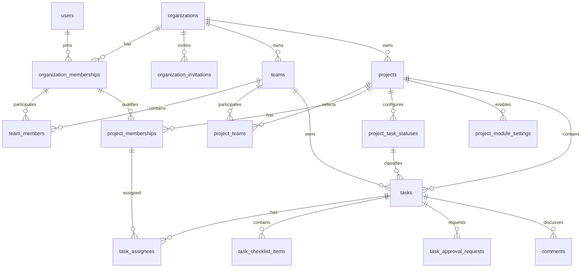
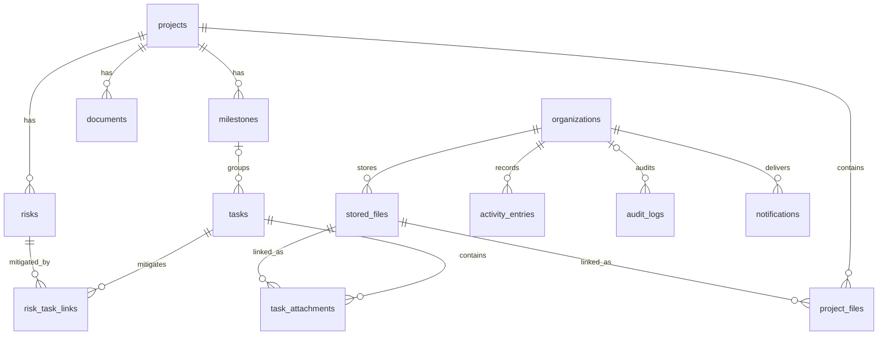

# PostgreSQL Target Data Model v0.3

> **Trạng thái:** Accepted  
> **Ngày:** 2026-08-23  
> **Business baseline:** [`TASKFORGE_BUSINESS_SCOPE_v0.3.md`](./TASKFORGE_BUSINESS_SCOPE_v0.3.md) — Accepted  
> **Architecture baseline:** [`TARGET_TECHNICAL_ARCHITECTURE_v0.3.md`](./TARGET_TECHNICAL_ARCHITECTURE_v0.3.md) và [ADR-001..004](../.spec-kit/adr/) — Accepted  
> **Phạm vi:** Target relational model; không phải Prisma schema, migration SQL, implementation plan hoặc Refactor Roadmap.

## 1. Mục tiêu và giới hạn

Tài liệu này chuyển domain model đã Accepted thành physical relational model đủ rõ để review trước khi viết Prisma schema/migration và trước khi lập Refactor Roadmap.

Source of truth theo thứ tự:

1. Business Scope v0.3 cho behavior và invariant.
2. Target Technical Architecture v0.3 cho module, authorization, transaction và persistence boundary.
3. ADR-001..004 cho source organization, PostgreSQL-only target, tenant isolation và UUID v4.
4. MongoDB/Mongoose hiện tại chỉ là legacy/reference; mọi conflict được giải theo ba nguồn trên.

Tài liệu này không:

- thay đổi Business Scope hoặc giải quyết các business TBD bằng assumption;
- tạo Prisma schema, migration, seed, RLS, partitioning hoặc cache;
- mô tả MongoDB/PostgreSQL dual-write hay target coexistence;
- quy định phase/PR/refactor order;
- tạo một table cho mọi logical entity nếu physical representation đơn giản hơn vẫn giữ đúng semantic.

## 2. Quyết định physical model

### 2.1. Persistence và identifier

- PostgreSQL là persistence duy nhất của target runtime.
- Mọi surrogate entity ID dùng UUID v4.
- Public API coi ID là opaque string.
- `organization_id` được lưu tường minh trên tenant-scoped table để query fail-closed, tạo composite FK và hỗ trợ index.
- RLS không thuộc schema v1 này; tenant correctness dựa trên active Membership, explicit application scoping, resource ownership và relational constraints.

### 2.2. Domain-to-table mapping quan trọng

| Logical concept | Physical representation được chọn | Lý do |
|---|---|---|
| Organization Owner | Active `organization_memberships.role = OWNER` | Không có `organizations.owner_id`; Membership là role SoT duy nhất |
| Team membership | `team_members` relation | Không embedded array; không có Team role |
| Project Participants | `project_teams` + `project_memberships` | Hai concept riêng, add Team không auto-add Member |
| Project Task Status | `project_task_statuses` + Task FK | Không global Task Status enum |
| Checklist | Chỉ `task_checklist_items`; không cần `checklists` table | Checklist là logical Task-owned component; existence được suy từ active item |
| Approval configuration | Các cột trên `tasks` | Approval là optional Task-related capability trong v1 |
| Approval request/history | Một row cho mỗi vòng trong `task_approval_requests` | Request timestamp và terminal outcome được giữ; vòng mới insert row mới, không overwrite vòng cũ |
| Comment | `comments`, thuộc Task module | Cần soft delete và author context nhưng không cần top-level domain riêng |
| Task Attachment | `task_attachments` -> `stored_files` | Core capability, không phụ thuộc Files module |
| Project Files | `project_files` -> `stored_files` | Project-wide library được module setting kiểm soát |
| Activity/Audit/Notification | Ba table riêng | Khác source classification và reliability semantics |

Approval không có ba table bắt buộc. Cấu hình hiện tại nằm trên Task; mỗi `task_approval_requests` row giữ cả request identity, approver snapshot, requested time và terminal action/outcome. Row terminal không được tái sử dụng; request mới luôn insert row mới.

### 2.3. Naming, type và lifecycle convention

- Table/column dùng `snake_case`, tên table số nhiều.
- Thời gian dùng `timestamptz` và lưu UTC.
- Email dùng `citext` hoặc normalized-email strategy tương đương; schema target ưu tiên `citext`.
- Các field tiền tố `created_`, `updated_`, `archived_`, `removed_`, `resolved_` phản ánh lifecycle, không thay thế Activity/Audit.
- Business data có history dùng archive/soft removal. Hard delete mặc định bị chặn bằng FK `RESTRICT/NO ACTION`; physical purge chỉ là retention/operational flow riêng.
- JSONB chỉ dùng cho safe metadata/payload linh hoạt của Activity/Audit/Notification, không dùng thay relational core.
- Chỉ entity/race cần concurrency control mới có `version`; không thêm optimistic version cho mọi table.

### 2.4. PostgreSQL enum ổn định

Chỉ dùng database enum cho vocabulary đã khóa:

| Enum | Values |
|---|---|
| `organization_role` | `OWNER`, `ADMIN`, `MEMBER` |
| `organization_membership_state` | `ACTIVE`, `SUSPENDED`, `REVOKED`, `LEFT` |
| `invitation_state` | `PENDING`, `ACCEPTED`, `REJECTED`, `REVOKED`, `EXPIRED` |
| `project_role` | `PROJECT_MANAGER`, `CONTRIBUTOR` |
| `project_state` | `DRAFT`, `ACTIVE`, `COMPLETED`, `ARCHIVED` |
| `task_status_semantic_category` | `NOT_STARTED`, `IN_PROGRESS`, `REVIEW`, `COMPLETED`, `CANCELLED` |
| `project_module_code` | `MILESTONES`, `DOCUMENTS`, `FILES`, `RISKS` |
| `approval_request_state` | `PENDING`, `APPROVED`, `REJECTED`, `CANCELLED` |
| `risk_state` | `OPEN`, `MITIGATING`, `RESOLVED` |

Task priority, Milestone lifecycle, file storage state, Notification delivery state và các policy vocabulary chưa khóa dùng bounded text code/application validation thay vì tự thêm business enum.

## 3. Relational model tổng thể

### 3.1. Core cardinality

| Parent | Child/relation | Cardinality | Ghi chú |
|---|---|---:|---|
| User | OrganizationMembership | `1:N` | User global, role nằm trên Membership |
| Organization | OrganizationMembership/Invitation/Team/Project | `1:N` | Organization là tenant root |
| OrganizationMembership | TeamMember | `1:N` | Một Member có thể thuộc nhiều Team |
| Team | ProjectTeam | `1:N` | Project-Team là N:N qua relation |
| Project | ProjectMembership | `1:N` | Một User tối đa một Membership/Project |
| Project | ProjectTaskStatus/ProjectModuleSetting | `1:N` | Status/module config thuộc Project |
| Project | Task | `1:N` | Task luôn thuộc đúng một Project |
| Task | TaskAssignee/ChecklistItem/ApprovalRequest/Comment | `1:N` | Approval config nằm trên Task |
| StoredFile | TaskAttachment/ProjectFile | `1:N` | Visibility đến từ relation |
| Project | Milestone/Document/Risk | `1:N` | Optional module data vẫn giữ khi disabled |
| Risk | Task | `N:N` | Qua `risk_task_links`, cùng Project |

### 3.2. Core ERD

### 3.3. Files và optional modules ERD

Mermaid biểu diễn business relationship chính; composite same-tenant keys và lifecycle conditions được định nghĩa ở các section sau.

## 4. Table definitions

Ký hiệu: `PK` primary key, `FK` foreign key, `UQ` unique constraint/index. Mọi UUID ID do application/ORM hoặc PostgreSQL tạo theo UUID v4 convention thống nhất; exact generator được khóa khi viết executable schema.

### 4.1. Identity và Organization

#### `users`

Global identity, không tenant ownership.

| Column | Type/nullability | Constraint/meaning |
|---|---|---|
| `id` | `uuid not null` | PK |
| `email` | `citext not null` | UQ toàn hệ thống |
| `name` | `text not null` | Display profile |
| `password_hash` | `text not null` | Không expose/log |
| `profile_image_url` | `text null` | Profile metadata |
| `email_verified_at` | `timestamptz null` | Identity verification |
| `refresh_token_hash` | `text null` | Minimal v1 authentication persistence cho current-session flow; không phải authorization role |
| `disabled_at` | `timestamptz null` | Technical/global identity disable; exact policy còn deferred |
| `created_at`, `updated_at` | `timestamptz not null` | Technical timestamps |

Không có `organization_id`, `role`, `team_id` hoặc organization lifecycle field trên User. `refresh_token_hash` phản ánh authentication implementation v1 hiện tại, không khóa User vào mô hình một session vĩnh viễn. Nếu phát sinh requirement multi-device/multi-session, persistence có thể tách thành `user_sessions` mà không thay đổi core domain model; v0.3 chưa cần table này.

Indexes: unique `email`; index `disabled_at` chỉ cần nếu operational query chứng minh cần.

#### `organizations`

| Column | Type/nullability | Constraint/meaning |
|---|---|---|
| `id` | `uuid not null` | PK, tenant root |
| `name` | `text not null` | Không global unique |
| `logo_url` | `text null` | Metadata |
| `archived_at` | `timestamptz null` | Organization archive/close representation tối thiểu |
| `created_at`, `updated_at` | `timestamptz not null` | Technical timestamps |

Không có `owner_id`, embedded members, plan/billing hoặc required slug. Owner được resolve từ active Membership. Slug có thể thêm sau nếu addressing policy được chốt.

#### `organization_memberships`

| Column | Type/nullability | Constraint/meaning |
|---|---|---|
| `id` | `uuid not null` | PK |
| `organization_id` | `uuid not null` | FK -> organizations |
| `user_id` | `uuid not null` | FK -> users |
| `role` | `organization_role not null` | Organization role SoT |
| `state` | `organization_membership_state not null` | Default `ACTIVE` khi business operation hợp lệ |
| `joined_at` | `timestamptz not null` | Membership start |
| `state_changed_at` | `timestamptz not null` | Lifecycle evidence helper |
| `created_at`, `updated_at` | `timestamptz not null` | Technical timestamps |

Constraints/indexes:

- UQ `(user_id, organization_id)`.
- UQ `(organization_id, id)` làm đích composite FK.
- Partial UQ `(organization_id)` where `role = OWNER AND state = ACTIVE`: tối đa một active Owner.
- Index `(user_id, state)` cho workspace discovery.
- Index `(organization_id, state, role)` cho directory/RBAC/last-owner query.

Membership không hard delete. Exactly-one active Owner cần application transaction vì partial unique chỉ bảo vệ upper bound.

#### `organization_invitations`

| Column | Type/nullability | Constraint/meaning |
|---|---|---|
| `id` | `uuid not null` | PK |
| `organization_id` | `uuid not null` | FK -> organizations |
| `email` | `citext not null` | Recipient identity candidate |
| `invited_role` | `organization_role not null` | Default `MEMBER`; Owner activation vẫn chỉ qua transfer operation |
| `invited_by_membership_id` | `uuid not null` | Composite FK cùng Organization |
| `token_hash` | `text not null` | UQ; không lưu raw token |
| `state` | `invitation_state not null` | Lifecycle SoT |
| `expires_at` | `timestamptz not null` | Expiry |
| `responded_at` | `timestamptz null` | Accepted/rejected/revoked time |
| `accepted_user_id` | `uuid null` | FK -> users khi accepted |
| `created_at`, `updated_at` | `timestamptz not null` | Technical timestamps |

Constraints/indexes:

- UQ `token_hash`.
- Partial UQ `(organization_id, email)` where `state = PENDING`.
- Index `(email, state, expires_at)` cho invitation discovery.
- Composite FK `(organization_id, invited_by_membership_id)` -> Membership.
- Application không tạo Owner bằng invitation; Owner transfer là command riêng.

Accept invitation và create/activate Membership chạy cùng transaction. Không có Team invitation table trong target v0.3.

### 4.2. Team

#### `teams`

| Column | Type/nullability | Constraint/meaning |
|---|---|---|
| `id` | `uuid not null` | PK |
| `organization_id` | `uuid not null` | FK -> organizations |
| `name` | `text not null` | Team display name |
| `description` | `text not null default ''` | Metadata |
| `logo_url` | `text null` | Metadata |
| `archived_at` | `timestamptz null` | Archive, không hard delete |
| `created_at`, `updated_at` | `timestamptz not null` | Technical timestamps |

UQ `(organization_id, id)` làm composite FK target. Không có Team role, `require_approval` hoặc embedded member/invitation. Team-name uniqueness chưa được Business Scope khóa nên chỉ index `(organization_id, archived_at, name)` cho list/search, không unique.

#### `team_members`

| Column | Type/nullability | Constraint/meaning |
|---|---|---|
| `organization_id` | `uuid not null` | Tenant key |
| `team_id` | `uuid not null` | Team FK |
| `organization_membership_id` | `uuid not null` | Membership FK |
| `joined_at` | `timestamptz not null` | Current relation joined time |
| `removed_at` | `timestamptz null` | Null = current Team Member |
| `created_at`, `updated_at` | `timestamptz not null` | Technical timestamps |

PK `(team_id, organization_membership_id)`. Composite FKs bảo đảm Team và Membership cùng Organization. Không có `role` column. Re-add có thể reactivate cùng logical relation; detailed cycles được giữ ở Audit/Activity thay vì tạo Team role/history model mới.

Indexes:

- `(organization_id, organization_membership_id, removed_at)` cho directory/eligibility.
- `(organization_id, team_id, removed_at)` cho Team member list.

DB bảo vệ same-tenant relation; active Membership eligibility và dependency khi remove/archive do application transaction bảo vệ.

### 4.3. Project và Participants

#### `projects`

| Column | Type/nullability | Constraint/meaning |
|---|---|---|
| `id` | `uuid not null` | PK |
| `organization_id` | `uuid not null` | FK -> organizations |
| `name` | `text not null` | Không global/org unique mặc định |
| `description` | `text not null default ''` | Metadata |
| `state` | `project_state not null` | Lifecycle SoT |
| `start_date`, `due_date` | `date null` | Planning metadata |
| `created_by_membership_id` | `uuid not null` | Composite FK cùng Organization |
| `completed_at`, `archived_at` | `timestamptz null` | Lifecycle timestamps |
| `version` | `bigint not null default 0` | Lifecycle/concurrency control |
| `created_at`, `updated_at` | `timestamptz not null` | Technical timestamps |

UQ `(organization_id, id)`. Index `(organization_id, state, updated_at desc)`. Project name uniqueness chưa khóa nên không có unique constraint.

#### `project_teams`

Tập Participating Teams; không tạo Project Members tự động.

| Column | Type/nullability | Constraint/meaning |
|---|---|---|
| `organization_id` | `uuid not null` | Tenant key |
| `project_id` | `uuid not null` | Project FK |
| `team_id` | `uuid not null` | Team FK |
| `added_by_membership_id` | `uuid not null` | Actor trong Organization |
| `added_at` | `timestamptz not null` | Participation start |
| `removed_at` | `timestamptz null` | Null = currently participating |

PK `(project_id, team_id)`. Composite FKs `(organization_id, project_id)` và `(organization_id, team_id)` bảo vệ tenant. UQ `(organization_id, project_id, team_id)` làm target cho Task owning-Team FK.

FK không thể yêu cầu `removed_at is null`; add/remove Task/Member vẫn phải kiểm active relation trong application transaction.

#### `project_memberships`

| Column | Type/nullability | Constraint/meaning |
|---|---|---|
| `id` | `uuid not null` | PK; assignee/approver reference |
| `organization_id` | `uuid not null` | Tenant key |
| `project_id` | `uuid not null` | Project FK |
| `organization_membership_id` | `uuid not null` | Organization Member FK |
| `role` | `project_role not null` | Exactly one Project role |
| `added_at` | `timestamptz not null` | Participation start |
| `removed_at` | `timestamptz null` | Null = active Project relation |
| `updated_at` | `timestamptz not null` | Technical timestamp |

Constraints/indexes:

- UQ `(project_id, organization_membership_id)`.
- UQ `(organization_id, project_id, id)` làm composite FK target.
- Composite FK to Project và OrganizationMembership cùng tenant.
- Index `(organization_id, project_id, removed_at, role)` cho participant/last-PM query.
- Index `(organization_id, organization_membership_id, removed_at)` cho user projects.

DB không thể declaratively chứng minh User thuộc ít nhất một active Participating Team. Qualifying Team và last active Project Manager là application transaction invariants.

#### `project_task_statuses`

| Column | Type/nullability | Constraint/meaning |
|---|---|---|
| `id` | `uuid not null` | PK |
| `organization_id` | `uuid not null` | Tenant key |
| `project_id` | `uuid not null` | Project FK |
| `name` | `text not null` | Display/Board column name |
| `semantic_category` | `task_status_semantic_category not null` | Stable system meaning |
| `position` | `integer not null` | Check `position >= 0` |
| `archived_at` | `timestamptz null` | Null = active status |
| `version` | `bigint not null default 0` | Reorder/archive race control |
| `created_at`, `updated_at` | `timestamptz not null` | Technical timestamps |

Constraints/indexes:

- UQ `(organization_id, project_id, id)` làm Task FK target.
- Partial UQ `(project_id, position)` where `archived_at is null`.
- Index `(organization_id, project_id, archived_at, position)` cho Board config.
- Không unique display `name` cho tới khi `TBD-STATUS-01` được chốt.

Minimum active `NOT_STARTED`, `IN_PROGRESS`, `COMPLETED`; archive-in-use/migrate; exact transition permission đều thuộc application transaction/policy.

#### `project_module_settings`

| Column | Type/nullability | Constraint/meaning |
|---|---|---|
| `organization_id` | `uuid not null` | Tenant key |
| `project_id` | `uuid not null` | Project FK |
| `module_code` | `project_module_code not null` | Chỉ bốn module v1 |
| `enabled` | `boolean not null` | Configuration SoT |
| `version` | `bigint not null default 0` | Concurrent toggle control khi cần |
| `created_at`, `updated_at` | `timestamptz not null` | Technical timestamps |

PK `(project_id, module_code)`; composite FK to Project. Project creation transaction tạo đúng bốn row; default enabled values là `TBD-MOD-01`. Disable chỉ đổi `enabled`, không cascade/delete module data.

### 4.4. Task, Checklist, Approval và Comment

#### `tasks`

| Column | Type/nullability | Constraint/meaning |
|---|---|---|
| `id` | `uuid not null` | PK |
| `organization_id` | `uuid not null` | Tenant key |
| `project_id` | `uuid not null` | Required Project FK |
| `owning_team_id` | `uuid not null` | Required Participating Team FK |
| `status_id` | `uuid not null` | ProjectTaskStatus FK |
| `creator_project_membership_id` | `uuid not null` | Creator Project Member context |
| `milestone_id` | `uuid null` | Optional same-Project Milestone |
| `title` | `text not null` | Task content |
| `description` | `text not null default ''` | Task content |
| `priority_code` | `varchar(32) not null` | Vocabulary controlled by Task spec; no DB enum yet |
| `due_at` | `timestamptz null` | Optional management/planning field; Business Scope không bắt buộc mọi Task có due date |
| `manual_progress` | `smallint not null default 0` | Check `0..100`; ignored when active checklist exists |
| `requires_approval` | `boolean not null default false` | Approval configuration |
| `approver_project_membership_id` | `uuid null` | Designated approver when required |
| `version` | `bigint not null default 0` | State/management concurrency |
| `archived_at` | `timestamptz null` | Soft archive |
| `created_at`, `updated_at` | `timestamptz not null` | Technical timestamps |

Constraints:

- UQ `(organization_id, project_id, id)` làm child FK target.
- Composite FK `(organization_id, project_id, owning_team_id)` -> `project_teams`.
- Composite FK `(organization_id, project_id, status_id)` -> `project_task_statuses`.
- Composite FK creator/approver -> `project_memberships` cùng tenant/project.
- Composite FK optional Milestone -> `milestones` cùng tenant/project.
- Check `(requires_approval AND approver_project_membership_id IS NOT NULL) OR (NOT requires_approval AND approver_project_membership_id IS NULL)`.

FK chứng minh relation row tồn tại, không chứng minh ProjectTeam/ProjectMembership/Status/Milestone còn active. Application revalidate lifecycle trong command transaction.

Indexes:

- `(organization_id, project_id, status_id, archived_at, created_at desc)` cho Board.
- `(organization_id, project_id, owning_team_id, archived_at, due_at)` cho List/Team filters.
- `(organization_id, due_at)` partial where `archived_at is null and due_at is not null` cho reminder/overdue scan.
- `(organization_id, project_id, milestone_id)` partial where `milestone_id is not null`.

Task không lưu semantic category, effective progress, approval state, `approved_by` hoặc overwritten `rejection_reason`. Các giá trị đó được derive từ referenced Status, checklist và Approval Request history theo approval policy hiện hành.

#### `task_assignees`

| Column | Type/nullability | Constraint/meaning |
|---|---|---|
| `organization_id`, `project_id` | `uuid not null` | Tenant/Project keys |
| `task_id` | `uuid not null` | Task FK |
| `project_membership_id` | `uuid not null` | Assignee Project Member FK |
| `assigned_by_project_membership_id` | `uuid not null` | Actor context |
| `assigned_at` | `timestamptz not null` | Assignment start |
| `removed_at` | `timestamptz null` | Null = current assignee |

PK `(task_id, project_membership_id)`. Composite FKs ensure Task, assignee và actor thuộc cùng Project/Organization. Index `(organization_id, project_membership_id, removed_at, task_id)` cho My Tasks và `(organization_id, project_id, task_id, removed_at)` cho Task detail.

TeamMember intersection với current owning Team không thể được bảo vệ ổn định chỉ bằng FK vì owning Team có thể đổi; assignment/change-Team command phải lock/revalidate Task, ProjectMembership và TeamMember.

#### `task_checklist_items`

| Column | Type/nullability | Constraint/meaning |
|---|---|---|
| `id` | `uuid not null` | PK |
| `organization_id`, `project_id` | `uuid not null` | Tenant/Project keys |
| `task_id` | `uuid not null` | Composite Task FK |
| `text` | `text not null` | Item content |
| `position` | `integer not null` | Check `>= 0` |
| `completed_at` | `timestamptz null` | Null = incomplete |
| `completed_by_project_membership_id` | `uuid null` | Actor when completed |
| `removed_at` | `timestamptz null` | Soft removal |
| `created_at`, `updated_at` | `timestamptz not null` | Technical timestamps |

Constraints/indexes:

- Composite FK to Task and optional completing ProjectMembership.
- Check completed timestamp/actor cùng null hoặc cùng non-null.
- Partial UQ `(task_id, position)` where `removed_at is null`.
- Index `(organization_id, project_id, task_id, removed_at, position)`.

Checklist tồn tại khi Task có ít nhất một active item. Progress và completion gate là application/domain calculation trong Task transaction; không lưu duplicate checklist percentage.

#### `task_approval_requests`

Một row là một approval cycle; request cũ không bị overwrite bởi cycle mới.

| Column | Type/nullability | Constraint/meaning |
|---|---|---|
| `id` | `uuid not null` | PK/request identity |
| `organization_id`, `project_id` | `uuid not null` | Tenant/Project keys |
| `task_id` | `uuid not null` | Composite Task FK |
| `request_number` | `integer not null` | Monotonic trong Task, check `> 0` |
| `requested_by_membership_id` | `uuid not null` | Organization actor; application xác minh Project policy |
| `approver_project_membership_id` | `uuid not null` | Designated approver snapshot |
| `state` | `approval_request_state not null` | Current/terminal request outcome |
| `request_reason` | `text null` | Optional request context |
| `resolution_reason` | `text null` | Cancel/reject/decision reason theo policy |
| `resolved_by_membership_id` | `uuid null` | Organization actor; supports approver/cancel policy without schema change |
| `requested_at` | `timestamptz not null` | Immutable request time |
| `resolved_at` | `timestamptz null` | Terminal action time |
| `idempotency_key` | `text null` | Retry control |

Constraints/indexes:

- UQ `(task_id, request_number)`.
- Partial UQ `(task_id)` where `state = PENDING`: tối đa một pending request.
- Partial UQ `(task_id, idempotency_key)` where `idempotency_key is not null`.
- Composite FK to Task, approver ProjectMembership và requester/resolver OrganizationMembership cùng tenant.
- Check `PENDING` -> resolver/time null; terminal -> resolver/time non-null.
- Check `REJECTED`/`CANCELLED` có non-empty `resolution_reason`; `APPROVED` reason optional.
- Index `(organization_id, project_id, approver_project_membership_id, state, requested_at)` cho Approval queue.
- Index `(task_id, request_number desc)` cho completion gate/history.

Request tạo bằng insert. Approve/reject/cancel là conditional update `PENDING -> terminal`; terminal row không được chuyển lại hoặc tái sử dụng. Vòng mới luôn insert row mới. Task có `requires_approval = true` chỉ được semantic `COMPLETED` khi có Approval Request `APPROVED` hợp lệ theo approval policy hiện hành. Exact Task fields làm approval cũ mất hiệu lực, request lại sau thay đổi, self-approval và actor được cancel/reassign vẫn là feature-policy TBD; schema v0.3 không thiết kế trước revision/version mechanism cho các policy này.

#### `comments`

| Column | Type/nullability | Constraint/meaning |
|---|---|---|
| `id` | `uuid not null` | PK |
| `organization_id`, `project_id` | `uuid not null` | Tenant/Project keys |
| `task_id` | `uuid not null` | Composite Task FK |
| `author_project_membership_id` | `uuid not null` | Author Project context |
| `body` | `text not null` | Comment content |
| `edited_at` | `timestamptz null` | Edit metadata |
| `deleted_at` | `timestamptz null` | Soft delete |
| `deleted_by_membership_id` | `uuid null` | Author/moderator Organization actor |
| `created_at`, `updated_at` | `timestamptz not null` | Technical timestamps |

Composite FKs enforce same tenant/project; index `(organization_id, project_id, task_id, created_at)` supports timeline. Mention relation/table chưa cần ở v1; mention candidates có thể lưu trong safe parsed metadata hoặc table riêng khi Notification phase chứng minh cần query độc lập.

### 4.5. Files và Storage

#### `stored_files`

| Column | Type/nullability | Constraint/meaning |
|---|---|---|
| `id` | `uuid not null` | PK |
| `organization_id` | `uuid not null` | File metadata tenant |
| `storage_provider_code` | `varchar(32) not null` | Provider identifier, không phải business enum |
| `object_key` | `text not null` | Storage locator, không phải permission token |
| `original_name` | `text not null` | User-facing metadata |
| `media_type` | `text null` | MIME/media type |
| `size_bytes` | `bigint not null` | Check `>= 0` |
| `checksum_sha256` | `text null` | Integrity/dedup candidate |
| `uploaded_by_membership_id` | `uuid not null` | Same-Organization actor |
| `deleted_at` | `timestamptz null` | Metadata tombstone; physical deletion là operational flow |
| `created_at`, `updated_at` | `timestamptz not null` | Technical timestamps |

UQ `(organization_id, id)`; UQ `(storage_provider_code, object_key)`. Download authorization luôn đi qua Task/Project relation, không qua object key.

#### `task_attachments`

| Column | Type/nullability | Constraint/meaning |
|---|---|---|
| `id` | `uuid not null` | PK/API relation identity |
| `organization_id`, `project_id` | `uuid not null` | Tenant/Project keys |
| `task_id` | `uuid not null` | Task FK |
| `stored_file_id` | `uuid not null` | Same-tenant file FK |
| `attached_by_project_membership_id` | `uuid not null` | Actor Project context |
| `created_at` | `timestamptz not null` | Link time |
| `removed_at` | `timestamptz null` | Soft unlink |

Partial UQ `(task_id, stored_file_id)` where `removed_at is null`. Composite FKs enforce Task/Project/File tenant. Không có dependency hoặc FK tới `project_module_settings(FILES)`; Task Attachment hoạt động khi Files module disabled.

#### `project_files`

| Column | Type/nullability | Constraint/meaning |
|---|---|---|
| `id` | `uuid not null` | PK |
| `organization_id`, `project_id` | `uuid not null` | Tenant/Project keys |
| `stored_file_id` | `uuid not null` | Same-tenant file FK |
| `added_by_project_membership_id` | `uuid not null` | Actor Project context |
| `display_name` | `text null` | Optional library label |
| `created_at` | `timestamptz not null` | Link time |
| `removed_at` | `timestamptz null` | Soft unlink |

Partial UQ `(project_id, stored_file_id)` where `removed_at is null`. Files module enabled-state được kiểm ở application; disable không xóa row hoặc StoredFile.

### 4.6. Optional Project modules

#### `milestones`

| Column | Type/nullability | Constraint/meaning |
|---|---|---|
| `id` | `uuid not null` | PK |
| `organization_id`, `project_id` | `uuid not null` | Composite Project FK |
| `name` | `text not null` | Metadata |
| `description` | `text not null default ''` | Metadata |
| `status_code` | `varchar(32) not null` | Exact lifecycle vocabulary deferred |
| `due_date` | `date not null` | Milestone deadline |
| `closed_at`, `archived_at` | `timestamptz null` | Lifecycle timestamps |
| `created_at`, `updated_at` | `timestamptz not null` | Technical timestamps |

UQ `(organization_id, project_id, id)` làm Task optional FK target. Index `(organization_id, project_id, archived_at, due_date)`. Progress được aggregate từ Task; không lưu duplicate progress.

#### `documents`

| Column | Type/nullability | Constraint/meaning |
|---|---|---|
| `id` | `uuid not null` | PK |
| `organization_id`, `project_id` | `uuid not null` | Composite Project FK |
| `title` | `text not null` | Metadata |
| `content` | `text not null` | Baseline TaskForge-owned content; không collaborative document model |
| `author_project_membership_id` | `uuid not null` | Author Project context |
| `last_edited_by_project_membership_id` | `uuid not null` | Current editor context |
| `archived_at` | `timestamptz null` | Archive/soft removal |
| `created_at`, `updated_at` | `timestamptz not null` | Technical timestamps |

Index `(organization_id, project_id, archived_at, updated_at desc)`. Content versioning/rich format không thuộc v0.3 schema baseline.

#### `risks`

| Column | Type/nullability | Constraint/meaning |
|---|---|---|
| `id` | `uuid not null` | PK |
| `organization_id`, `project_id` | `uuid not null` | Composite Project FK |
| `title` | `text not null` | Risk content |
| `description` | `text not null default ''` | Risk content |
| `likelihood_code`, `impact_code` | `varchar(32) not null` | Exact scale deferred; application controlled |
| `owner_project_membership_id` | `uuid not null` | Required same-Project owner; exact eligibility policy deferred |
| `mitigation` | `text not null default ''` | Mitigation narrative |
| `state` | `risk_state not null` | Baseline workflow |
| `archived_at` | `timestamptz null` | Soft archive |
| `created_at`, `updated_at` | `timestamptz not null` | Technical timestamps |

UQ `(organization_id, project_id, id)`; composite FK của owner bảo đảm cùng Project/Organization; indexes `(organization_id, project_id, state, archived_at)` và owner lookup. Active owner eligibility beyond same Project remains module policy.

#### `risk_task_links`

Columns `organization_id`, `project_id`, `risk_id`, `task_id`, `created_at`; PK `(risk_id, task_id)`. Composite FKs enforce Risk và Task cùng Project/Organization. Risk resolution không transition Task và Task completion không resolve Risk.

Mọi optional-module table giữ data khi module disabled. Application gate chặn normal create/mutation; database không cascade theo module setting.

### 4.7. Activity, Audit và Notification

#### `activity_entries`

| Column | Type/nullability | Constraint/meaning |
|---|---|---|
| `id` | `uuid not null` | PK |
| `organization_id` | `uuid not null` | Tenant key |
| `project_id` | `uuid null` | Same-tenant Project context khi có |
| `actor_membership_id` | `uuid null` | Null cho system action |
| `action_code` | `varchar(64) not null` | User-facing activity type |
| `subject_type` | `varchar(64) not null` | Generic projection locator |
| `subject_id` | `uuid null` | Không generic FK |
| `safe_metadata` | `jsonb not null default '{}'` | Không chứa secret/business SoT |
| `source_event_id` | `uuid null` | Dedup/reconcile key |
| `occurred_at` | `timestamptz not null` | Timeline order |

UQ `(organization_id, source_event_id)` where source ID non-null. Composite FK áp dụng cho Project/actor khi các field có giá trị. Index `(organization_id, project_id, occurred_at desc)`. Generic subject không có FK vì Activity là projection; writer phải nhận verified tenant/resource context.

#### `audit_logs`

| Column | Type/nullability | Constraint/meaning |
|---|---|---|
| `id` | `uuid not null` | PK |
| `organization_id` | `uuid null` | Null chỉ cho global security event |
| `project_id` | `uuid null` | Resource context |
| `actor_user_id` | `uuid null` | Global actor identity |
| `actor_membership_id` | `uuid null` | Organization actor context |
| `action_code` | `varchar(96) not null` | Stable audited action |
| `target_type` | `varchar(64) not null` | Generic target locator |
| `target_id` | `uuid null` | Generic target ID |
| `outcome_code` | `varchar(32) not null` | Success/denied/failure technical outcome |
| `reason` | `text null` | Safe reason |
| `before_data`, `after_data` | `jsonb null` | Redacted safe metadata only |
| `correlation_id` | `uuid null` | Request/command correlation |
| `occurred_at` | `timestamptz not null` | Evidence time |

Nếu `actor_membership_id` có giá trị thì `organization_id` cũng phải có và composite FK bảo đảm cùng tenant; Project context dùng composite FK tương tự. Indexes `(organization_id, occurred_at desc)`, `(organization_id, project_id, occurred_at desc)`, `(actor_user_id, occurred_at desc)` và `(target_type, target_id, occurred_at desc)`. Application user không có update/delete path. DB runtime privileges nên append-only khi implementation được thiết kế; retention vẫn là operational policy.

#### `notifications`

| Column | Type/nullability | Constraint/meaning |
|---|---|---|
| `id` | `uuid not null` | PK |
| `organization_id` | `uuid not null` | Tenant context |
| `project_id` | `uuid null` | Same-tenant Project context khi có |
| `recipient_user_id` | `uuid not null` | Global recipient identity |
| `type_code` | `varchar(64) not null` | Notification type |
| `resource_type` | `varchar(64) null` | Generic locator |
| `resource_id` | `uuid null` | Generic resource ID |
| `safe_payload` | `jsonb not null default '{}'` | Display payload, không business SoT |
| `delivery_state_code` | `varchar(32) not null` | Technical state, vocabulary deferred |
| `deduplication_key` | `text null` | Delivery dedup |
| `read_at`, `delivered_at`, `failed_at`, `expires_at` | `timestamptz null` | Delivery/read lifecycle |
| `created_at`, `updated_at` | `timestamptz not null` | Technical timestamps |

Partial UQ `(organization_id, recipient_user_id, deduplication_key)` where key non-null. Index `(organization_id, recipient_user_id, read_at, created_at desc)` cho inbox và `(delivery_state_code, created_at)` cho worker. Recipient access phải được revalidate trước delivery; Notification không cấp permission và failure không rollback business state.

## 5. Composite tenant integrity

Mỗi tenant entity table có PK UUID và UQ `(organization_id, id)` khi được reference qua tenant boundary. Relation table mang `organization_id` tường minh và dùng composite FK.

Các composite FK quan trọng:

| Source | Target | Bảo vệ |
|---|---|---|
| TeamMember `(org, team)` | Team `(org, id)` | Team cùng tenant |
| TeamMember `(org, membership)` | OrganizationMembership `(org, id)` | Member cùng tenant |
| ProjectTeam `(org, project/team)` | Project/Team | Participating Team cùng tenant |
| ProjectMembership `(org, project/membership)` | Project/OrganizationMembership | Project Member cùng tenant |
| Task `(org, project, owning_team)` | ProjectTeam | Owning Team thuộc relation của chính Project |
| Task `(org, project, status)` | ProjectTaskStatus | Status thuộc chính Project |
| Task creator/approver | ProjectMembership `(org, project, id)` | Actor/approver thuộc Project |
| TaskAssignee `(org, project, task/member)` | Task/ProjectMembership | Assignee cùng Project/tenant |
| Child Task tables | Task `(org, project, id)` | Child không cross Project/tenant |
| Milestone/Risk/Document/File relations | Project/Task/File composite targets | Optional resource cùng tenant/context |

Composite FK không thay active/lifecycle/business eligibility checks. Ví dụ một ProjectTeam row đã `removed_at` vẫn tồn tại để giữ history; application phải reject việc dùng nó cho mutation mới.

## 6. Important indexes

Không index mọi FK/filter upfront. Baseline indexes phục vụ tenant boundary, authorization và use case đã biết:

| Use case | Index chính |
|---|---|
| Workspace discovery | Membership `(user_id, state)` |
| Org member/RBAC | Membership `(organization_id, state, role)` |
| Team membership eligibility | TeamMember `(organization_id, membership_id, removed_at)` |
| Project participants/last PM | ProjectMembership `(organization_id, project_id, removed_at, role)` |
| Board config | Status `(organization_id, project_id, archived_at, position)` |
| Board cards | Task `(organization_id, project_id, status_id, archived_at, created_at desc)` |
| Task list/filter | Task `(organization_id, project_id, owning_team_id, archived_at, due_at)` |
| My Tasks | TaskAssignee `(organization_id, project_membership_id, removed_at, task_id)` |
| Due/overdue worker | Partial Task `(organization_id, due_at)` for non-archived rows có `due_at is not null` |
| Approval queue | ApprovalRequest `(organization_id, project_id, approver_project_membership_id, state, requested_at)` |
| Task approval history | ApprovalRequest `(task_id, request_number desc)` |
| Activity timeline | Activity `(organization_id, project_id, occurred_at desc)` |
| Audit query | Audit `(organization_id, occurred_at desc)` và target/actor indexes |
| Notification inbox | Notification `(organization_id, recipient_user_id, read_at, created_at desc)` |

Search full-text, trigram, workload projection và dashboard-specific indexes chỉ thêm sau query plan/measurement. Cache/materialized view không thuộc physical transactional schema baseline.

## 7. Database vs application invariant matrix

| Invariant | Database enforcement | Application/transaction enforcement |
|---|---|---|
| User email unique | `citext` UQ | Normalize/map conflict |
| Membership unique User/Organization | UQ | Lifecycle command |
| Tối đa một active Owner | Partial UQ | Transfer command |
| Luôn có đúng một active Owner | Không bảo vệ lower bound | Lock Organization/current Owner/target Membership và update atomic |
| Team không role | Không có role column | Authorization không suy Team authority |
| TeamMember cùng tenant | Composite FK | Membership phải ACTIVE; removal dependency checks |
| Project có Participating Team | Relation/FK | Create/remove transaction giữ ít nhất một active relation |
| Project Member là active Org Member | FK tồn tại | Membership state check trong add/revoke transaction |
| Project Member thuộc Participating Team | FK hỗ trợ ingredients | Existential TeamMember ∩ active ProjectTeam check + locks |
| User tối đa một Project Membership | UQ | Reactivate/remove policy |
| Active Project có PM | Không bảo vệ lower bound | Lock Project/PM set; reject last PM removal/demotion |
| Owning Team thuộc Project | Composite FK ProjectTeam | ProjectTeam phải active; change-Team revalidate dependency |
| Assignee cùng Project | Composite FK | ProjectMembership active |
| Assignee thuộc owning Team | Không ổn định bằng simple FK | Assign/change-Team transaction kiểm TeamMember intersection |
| Status thuộc Project | Composite FK | Status active và transition/resource policy |
| Required semantic statuses tồn tại | Enum bảo vệ category | Create/archive status transaction giữ minimum set |
| Status đang dùng không hard delete | FK RESTRICT | Archive/migrate Task command |
| Checklist item progress source | Range/timestamp checks | Ignore/block manual progress khi active item; derive percentage |
| Checklist complete trước Task complete | Không phù hợp row check | Task transition transaction đọc active items |
| Approval config shape | Task CHECK approver required/null | Eligibility, pending bypass và approval policy |
| Một pending Approval Request | Partial UQ | Request transaction và idempotency |
| Approve/reject/cancel race | State/check constraints | Conditional `PENDING -> terminal` update |
| Required approval trước Task complete | Không phù hợp row check | Approval Request hợp lệ theo approval policy hiện hành phải `APPROVED` |
| Project complete chỉ khi terminal Tasks | Không phù hợp row check | Consistent Task query + Project lock/isolation |
| Disable module giữ data | FK không cascade | Toggle command; module gate block normal mutation |
| Task Attachment độc lập Files module | Không có module-setting dependency | Task execution/storage authorization |
| Risk/Task cùng Project | Composite FK | Module enabled và resource policy |
| Tenant isolation | Composite FK/UQ/index | Verified Membership + explicit org filter + resource policy |
| Audit append-only | Runtime privilege có thể harden | Không expose update/delete; redact secret |

Không dùng trigger cho lower-bound/existential/business-state invariant ở baseline. Trigger chỉ được cân nhắc nếu schema/application transaction đã chứng minh không đủ và phải có test/operational justification riêng.

## 8. Transaction và concurrency implications

Đây không phải implementation plan; bảng chỉ xác định data set phải được bảo toàn atomically khi schema được dùng:

| Operation | Rows/sets cần transaction/lock |
|---|---|
| Create Organization | Organization + Owner Membership + General Team + TeamMember |
| Transfer Owner | Organization row + active Owner + target Membership |
| Create Project | Project + ProjectTeam + ProjectMembership PM + default Statuses + four ModuleSettings |
| Add/remove Project Member | Membership + qualifying TeamMember/ProjectTeam + ProjectMembership + dependencies |
| Remove Participating Team | ProjectTeam + affected ProjectMembership qualification + Task owning-Team dependency |
| Assign/change owning Team | Task + ProjectTeam + ProjectMembership + TeamMember + assignees |
| Transition/complete Task | Task/version + target Status + Checklist summary + applicable Approval Request |
| Request Approval | Task approval config + insert ApprovalRequest cycle mới |
| Approve/reject/cancel | Conditional pending ApprovalRequest row + Audit/Activity intent theo reliability decision |
| Complete Project | Project lock + consistent non-terminal Task query |
| Enable/disable module | ProjectModuleSetting + required Audit; không delete module rows |

Isolation level/row-lock syntax được chọn khi thiết kế executable repository/migration; không cần global serializable transaction cho mọi CRUD.

## 9. Delete, archive và FK policy

- `users`, `organizations`, Membership, Project, Task, Approval Request, Comment, module data và audit/history không hard delete qua normal application flow.
- `archived_at` dùng cho Organization/Team/Task/module resource; `removed_at` dùng cho relation không còn active.
- FK tới business history mặc định `RESTRICT/NO ACTION`; không dùng broad cascade xóa tenant graph.
- Relation current-state có thể được reactivated bằng cách clear `removed_at` nếu business command cho phép; Activity/Audit giữ cycle history.
- Invitation token material có thể purge theo security retention nhưng invitation outcome record vẫn được giữ theo policy.
- StoredFile bytes chỉ physical-delete khi không còn active/historical reference cần giữ và retention cho phép.
- ProjectModuleSetting disable không có cascade.

Exact retention/anonymization là operational/legal TBD, không chặn relational ownership model.

## 10. Legacy MongoDB -> PostgreSQL differences

| Legacy Mongo assumption | PostgreSQL target |
|---|---|
| ObjectId và `@IsMongoId` | UUID v4, API opaque ID |
| `User.organization`, `User.role`, `User.team` | Loại bỏ; OrganizationMembership là SoT |
| `Organization.owner`, `members[]` | Owner/members từ Membership |
| Embedded Organization invitations | `organization_invitations` first-class rows/token hash |
| One-user-one-org registration | User global, nhiều Membership |
| Embedded Team members với `TEAM_LEAD` | `team_members`, không role |
| Team invitation/authority | Không có Team invitation table trong v0.3 |
| Team-level `requireApproval` | Loại bỏ; approval config thuộc Task |
| Project ngầm đồng nhất Team | Project/ProjectTeam/ProjectMembership first-class |
| Task chỉ thuộc Team | Task thuộc Project và một owning Participating Team |
| Fixed Task Status enum | ProjectTaskStatus rows + semantic category enum |
| `PENDING_APPROVAL`/`REJECTED` Task Status | Approval Request state độc lập Task Status |
| `approvedBy`/single overwritten rejection reason | Task config + immutable request cycles/outcome history |
| Embedded `assignedTo[]` | `task_assignees` relation |
| Embedded todo items | `task_checklist_items` rows |
| Attachment URL strings | StoredFile metadata + TaskAttachment/ProjectFile relations |
| Implicit fail-open tenant plugin | Explicit `organization_id`, composite FK và repository scoping |
| Mongo aggregate/dashboard | Indexed relational queries; projection/cache chỉ sau measurement |
| Team/project name unique assumptions | Không enforce nếu Business Scope chưa khóa |

Không có `legacy_mongo_id` trong target tables. Nếu production data bắt buộc giữ, ObjectId->UUID mapping dùng migration staging/artifact riêng, không làm ô nhiễm target runtime schema mặc định.

## 11. Deferred physical decisions

Không có deferred decision nào làm thay đổi core keys, tenant ownership hoặc relationship model. Các quyết định dưới đây chỉ khóa trước capability tương ứng:

| Decision | Current schema posture | Có chặn schema baseline? |
|---|---|---:|
| Organization slug/addressing | Không có required slug column | Không |
| Team/Project/Status name uniqueness | Index/search, không unique | Không |
| Task priority vocabulary | `priority_code varchar(32)` | Không |
| Milestone exact lifecycle | `status_code varchar(32)` | Không; chốt trước Milestone implementation |
| Risk likelihood/impact scale | Text codes | Không; chốt trước Risk implementation |
| Module default enable state | Bốn setting rows, values do creation policy | Không |
| Self-approval/approval invalidation/request lại/cancel actor | Immutable request cycles + generic actor references; không pre-model revision mechanism | Không; chốt trước Approval implementation |
| File provider/upload/scanning/retention | Stable metadata/relation; technical fields tối thiểu | Không; chốt trước Storage implementation |
| Notification delivery vocabulary/retention | Text code + lifecycle timestamps | Không |
| Mongo data cần giữ hay reset | Không thêm legacy column; staging nếu ETL thật sự cần | Không đối với target schema |
| RLS | Deferred defense-in-depth ADR | Không |

Nếu review sau này quyết định một deferred code phải thành PostgreSQL enum, thay đổi đó chỉ giới hạn ở capability table tương ứng và không mở lại domain hierarchy.

## 12. Schema stability assessment

### 12.1. Coverage

Schema bao phủ đầy đủ:

- User và authentication persistence tối thiểu;
- Organization, Membership, Invitation;
- Team/TeamMember không role;
- Project, hai participant relations, Project roles;
- Project-owned Task Status và fixed optional module settings;
- Project-aware Task, owning Team, assignee, checklist;
- physical Approval configuration/request/history representation;
- Comment, Activity, Audit, Notification;
- StoredFile, core Task Attachment và optional Project Files;
- Milestone, Document, Risk và mitigation Task links.

### 12.2. Readiness decision

**Đánh giá: đủ ổn định để dùng làm input cho Refactor Roadmap.**

Lý do:

- `Schema Blocking Decision = 0`.
- Tenant keys, PK/FK, cardinality và ownership đã rõ.
- Critical unique/composite/partial constraints và query indexes đã xác định.
- Business invariant nào thuộc DB và invariant nào cần application transaction đã được phân ranh giới.
- Approval physical representation đã được chọn mà không khóa logical model thành ba table.
- Deferred decisions không thay đổi core relationship graph.

Tài liệu chưa phải executable schema. Prisma schema/migration vẫn là implementation artifact riêng; Refactor Roadmap phải dùng Data Model Accepted này thay vì legacy Phase 2C enum/table assumptions.
